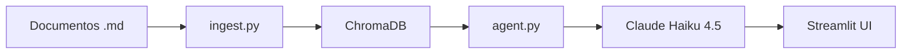

# ParecerBot

**Knowledge Agent interno para PX Ativos Judiciais.**

Indexa documentacao interna e responde perguntas com precisao, citando fontes, cruzando informacoes entre documentos e gerando rascunhos de parecer.



## Setup rapido

```bash
make setup                    # Cria venv, instala deps, copia .env
echo 'ANTHROPIC_API_KEY=sk-ant-...' >> .env
make ingest                   # Indexa documentos no ChromaDB
make run                      # Abre http://localhost:8501
```

## O que faz

- **Q&A com RAG** — Responde perguntas sobre processos internos com citacao de fonte (documento + secao)
- **Analise cruzada** — Compara informacoes entre documentos, identifica riscos e inconsistencias
- **Geracao** — Produz rascunhos de parecer, resumos executivos e checklists
- **Auditoria** — Todas as queries sao logadas com timestamp, chunks recuperados e latencia

## Arquitetura

| Modulo | Responsabilidade |
|--------|-----------------|
| `src/ingest.py` | Chunking (tiktoken cl100k_base, 500 tokens, heading-based) + embeddings (all-MiniLM-L6-v2) + ChromaDB |
| `src/agent.py` | RAG retrieval (top-8, cosine) + Claude Haiku 4.5 streaming + memoria (10 turnos) + logging JSONL |
| `src/app.py` | Chat Streamlit com fontes expasiveis, quick actions, copiar resposta, exportar conversa |

## Configuracao

| Variavel | Padrao | Descricao |
|----------|--------|-----------|
| `ANTHROPIC_API_KEY` | — | Chave de API (obrigatoria) |
| `RETRIEVAL_TOP_K` | 8 | Chunks recuperados por query |
| `RETRIEVAL_DISTANCE_MAX` | 1.0 | Distancia maxima cosine (menor = mais similar) |
| `CHROMA_PERSIST_DIR` | ./chroma_db | Diretorio de persistencia do indice |
| `MOCK_DATA_DIR` | ./docs/mock_data | Pasta com documentos para indexar |

## Como expandir para producao

Toda a stack foi desenhada para evoluir sem reescrita:

| Hoje (POC) | Amanha (producao) |
|-------------|-------------------|
| ChromaDB local | Pinecone ou pgvector |
| Streamlit | Next.js ou integracao no sistema de gestao |
| Claude Haiku 4.5 | Claude Sonnet (qualidade) ou Haiku (custo) |
| Mock data .md | Conectores ao sistema de gestao da PX |
| JSONL local | LangSmith ou dashboard dedicado |
| Sem autenticacao | SSO corporativo |

Veja o **[Playbook Estrategico](docs/playbook.md)** para o roadmap completo de 90 dias.

## Estrutura do repo

```
ParecerBot/
├── src/
│   ├── ingest.py          # Pipeline de dados
│   ├── agent.py           # Motor RAG
│   ├── app.py             # Interface Streamlit
│   └── config.py          # Configuracoes (.env)
├── docs/
│   ├── playbook.md        # Playbook estrategico (9 secoes)
│   └── mock_data/         # 8 documentos internos mockados
├── tests/
│   └── smoke_tests.md     # 10 perguntas de validacao manual
├── logs/                  # queries.jsonl (auditavel)
├── requirements.txt
├── .env.example
└── Makefile
```

## Entregaveis

- [x] Repo com README claro
- [x] Playbook estrategico (`docs/playbook.md`)
- [x] POC funcional com dados mockados
- [ ] Demo + walkthrough (Loom)
