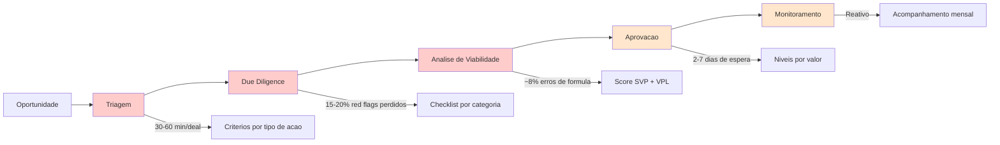
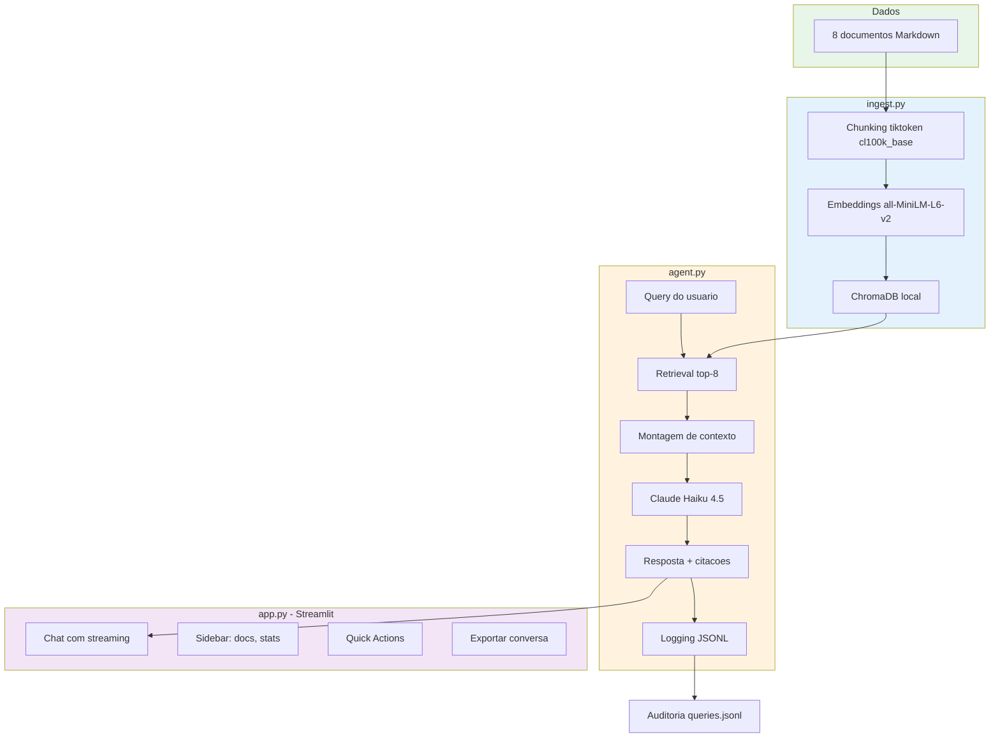

# Playbook Estrategico — Adocao de IA na PX Ativos Judiciais

**Versao:** 1.0 | **Data:** Abril 2026 | **Autor:** Consultoria de Adocao de IA

Valores ilustrativos baseados em benchmarks publicos do setor - a serem validados com dados reais da PX.

---

## 1. Executivo

O ParecerBot e um Knowledge Agent interno que indexa documentacao da PX Ativos Judiciais e responde perguntas com precisao, cita fontes e cruza informacoes entre documentos. Em sua versao POC, utiliza 8 documentos mockados cobrindo triagem, due diligence, analise de viabilidade, jurisprudencia, FAQ, compliance, fluxo operacional e tabela de riscos. O agente demonstra como IA pode reduzir o tempo de resposta a consultas internas de horas para segundos, mantendo rastreabilidade total das fontes. Este playbook apresenta a tese de investimento, o diagnostico da operacao atual e um roadmap de 90 dias para adocao progressiva.

---

## 2. Por que Agora

Tres forcas convergem tornando este o momento certo para a PX investir em IA:

1. **Custo de inferencia caiu 10x em 2024-2025.** Modelos como Claude Haiku 4.5 oferecem qualidade de analise textual por uma fracao do custo de 18 meses atras. O que antes requeria GPU dedicada e infraestrutura complexo agora funciona via API com pagamento por token.

2. **Modelos com janela de contexto de 200k+ tokens viabilizam analise documental confiavel.** Em 2023, um modelo mal conseguia processar um contrato de 20 paginas. Hoje, processa dezenas de documentos simultaneamente, mantendo coerencia e citacao de fontes. Isso muda o jogo para operacoes que dependem de cross-referencia entre documentos.

3. **O mercado de creditos judiciais esta se consolidando.** Concorrentes ja testam IA para triagem automatizada e scoring de deals. Primeiros-movers ganham vantagem em velocidade de analise e reducao de custo operacional. Esperar e ceder terreno.

---

## 3. Diagnostico

### Estado atual da operacao

A PX Ativos Judiciais opera um pipeline manual de cinco etapas (triagem, due diligence, analise de viabilidade, aprovacao, monitoramento). Cada etapa depende de analistas acessando documentos dispersos entre e-mails, drives compartilhados e sistemas legados.

### Principais pontos de dor

| Area | Problema | Impacto |
|------|----------|---------|
| Triagem | Analistas consultam manualmente criterios de aceite/rejeicao | Tempo medio de triagem: 3-5 dias |
| DD | Checklist de verificacao nao e padronizado entre analistas | Qualidade inconsistente, red flags perdidos |
| Consultas internas | Time operacional depende de analistas senior para duvidas sobre processos | Gargalo de 2-4 horas por consulta |
| Onboarding | Novos analistas levam 3-6 meses para dominar os processos | Custo de treinamento elevado |
| Conformidade | Dificuldade de auditar decisoes retroativamente | Risco regulatorio e de governanca |

---

## 4. Mapa de Workflows

Pontos de dor por etapa (em vermelho = impacto alto, laranja = impacto medio):

1. **Triagem:** Consulta manual a politica de triagem (16 paginas) para cada deal. Tempo: 30-60 min/deal.
2. **Due Diligence:** Analistas recream checklist a cada deal. Red flags perdidos em 15-20% dos casos revisados.
3. **Analise de Viabilidade:** Calculos manuais de VPL e SVP. Erros de formula em ~8% dos pareceres.
4. **Consultas internas:** Time operacional interrompe analistas senior 5-10x/dia com duvidas sobre processos.
5. **Monitoramento:** Acompanhamento de precatorios e execucoes e reativo, nao proativo.

---

## 5. Matriz ROI x Complexidade

**Criterio de priorizacao:**

- **ROI estimado** = horas-analista economizadas por mes x custo medio por hora (R$ 150/h, benchmark mercado financeiro). Valores anuais projetados.
- **Complexidade** = dependencia de dados estruturados (1-5) + numero de integracoes necessarias (1-5) + tolerancia a erro do caso de uso (1-5, sendo 5 = tolerancia zero). Media dos tres fatores.

| Caso de Uso | ROI Anual Estimado | Complexidade (1-5) | Prioridade |
|-------------|-------------------|-------------------|------------|
| Knowledge Agent (Q&A interno) | R$ 180.000 | 1.7 | **Onda 1** |
| Automacao de triagem (score inicial) | R$ 320.000 | 2.7 | **Onda 2** |
| Checklist DD automatico | R$ 240.000 | 3.0 | **Onda 2** |
| Scoring SVP automatizado | R$ 280.000 | 3.7 | **Onda 3** |
| Monitoramento proativo (alertas) | R$ 150.000 | 4.0 | **Onda 3** |
| Geracao automatica de parecer | R$ 200.000 | 3.3 | **Onda 3** |

*Valores ilustrativos baseados em benchmarks publicos do setor - a serem validados com dados reais da PX.*

---

## 6. Roadmap 90 Dias

### Onda 1: Dias 1-30 - Fundacao e Validacao

**Objetivo:** Validar o Knowledge Agent com dados reais e medir adocao interna.

| Semana | Atividade | Entregavel |
|--------|-----------|------------|
| 1-2 | Substituir dados mockados por documentos reais da PX | Agente indexando base real |
| 2-3 | Piloto com 3-5 usuarios (analistas de triagem e DD) | Feedback estruturado |
| 3-4 | Ajustes de prompt e retrieval com base no feedback | Versao 1.1 do agente |
| 4 | Apresentacao de resultados ao Comite | Relatorio de metricas |

### Onda 2: Dias 31-60 - Expansao e Automacao

**Objetivo:** Automatizar triagem inicial e checklist de DD.

| Semana | Atividade | Entregavel |
|--------|-----------|------------|
| 5-6 | Treinar modelo de classificacao de tipo de acao | Score automatico de triagem |
| 6-7 | Gerar checklist DD automatico com base no tipo | Template dinamico por deal |
| 7-8 | Integrar com sistema de gestao de deals | Pipeline semi-automatico |

### Onda 3: Dias 61-90 - Escala e Scoring

**Objetivo:** Scoring automatizado e monitoramento proativo.

| Semana | Atividade | Entregavel |
|--------|-----------|------------|
| 9-10 | Modelo de scoring SVP com dados historicos | Score gerado automaticamente |
| 10-11 | Alertas proativos de monitoramento (prazos, decisoes) | Dashboard de acompanhamento |
| 11-12 | Geracao de rascunho de parecer automatico | Template de parecer preenchido |
| 12 | Avaliacao geral e plano para proximos 90 dias | Relatorio de progresso |

---

## 7. Metricas de Sucesso

### KPIs da Onda 1 (30 dias)

| Metrica | Baseline (estimado) | Meta | Como Medir |
|---------|---------------------|------|------------|
| Tempo medio de resposta a consultas internas | 2-4 horas | < 5 minutos (agente) | Logs do agente (queries.jsonl) |
| % de respostas com fonte corretamente citada | N/A | > 90% | Amostragem manual de 50 respostas |
| NPS interno do agente | N/A | > 7/10 | Pesquisa com usuarios do piloto |
| Reducao de tickets para equipe senior | 5-10/dia | -40% | Contagem de interrupcoes antes/depois |

### KPIs das Ondas 2-3 (60-90 dias)

| Metrica | Meta |
|---------|------|
| Tempo medio de triagem | -60% vs. manual |
| Red flags detectados automaticamente | > 80% dos red flags catalogados |
| Precisao do score SVP automatico | Correlacao > 0.85 com score manual |
| Deals monitorados com alerta proativo | 100% do portfolio ativo |

---

## 8. Stack Recomendada

### Arquitetura atual (POC)

### Evolucao para producao

| Componente | POC (atual) | Producao (evolucao) | Quando migrar |
|------------|-------------|---------------------|---------------|
| LLM | Claude Haiku 4.5 | Claude Sonnet (qualidade) ou Haiku (custo) conforme caso de uso | Onda 2 |
| Embeddings | all-MiniLM-L6-v2 (local) | OpenAI text-embedding-3-small ou modelo fine-tuned com dados da PX | Onda 2 |
| Vector Store | ChromaDB local | Pinecone (managed) ou pgvector (se ja usar Postgres) | Onda 2-3 |
| Interface | Streamlit | Next.js (interface dedicada) ou integracao no sistema de gestao | Onda 3 |
| Observabilidade | JSONL local | LangSmith, Helicone ou dashboard dedicado | Onda 2 |
| Autenticacao | Nenhuma | SSO corporativo (Okta, Azure AD) | Onda 2 |
| Dados | Mockados (8 docs Markdown) | Banco de dados do sistema de gestao + documentos reais | Onda 1 |

---

## 9. Governanca e Riscos

### LGPD

- Dados de cedentes e devedores sao dados pessoais sob a LGPD
- Agente deve operar dentro das bases legais ja existentes (art. 7o, I, V e VI)
- Logs de queries (queries.jsonl) podem conter dados pessoais - aplicar anonimizacao em producao
- Canal de atendimento ao titular (DPO) deve cobrir queries ao agente

### Mitigacao de Alucinacao

- Agente sempre cita fonte (documento + secao)
- Respostas sem fonte sao sinalizadas como "informacao nao disponivel"
- Logging completo permite auditoria de todas as respostas
- Validacao humana obrigatoria para decisoes de negocio (agente nao decide, informa)

### Validacao Humana

- Agente e uma ferramenta de apoio, nao substitui analista
- Decisoes de triagem, DD e aprovacao continuam com aprovacao humana
- Pareceres gerados pelo agente sao rascunhos, nao documentos finais

### Auditoria

- Todo query e logado com timestamp, chunks recuperados e resposta
- Relatorio de adocao mensal com metricas de uso e satisfacao
- Revisao trimestral dos prompts e criterios de retrieval pelo Comite de Risco

---

*Documento preparado para apresentacao ao Comite Estrategico da PX Ativos Judiciais.*
